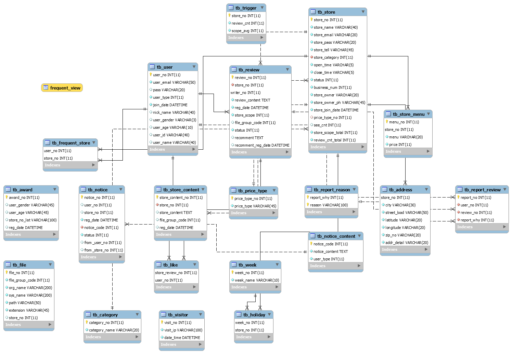
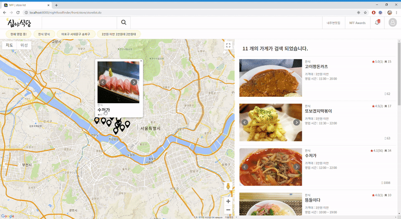

# 심야식당 서비스

## 개요
*현재 영업 중 인 식당의 정보를 
접속 위치 기반으로 여러 조건에 맞게 제공하는 웹 서비스*

## 주요 기술
- Java, JSP, JSTL, EL
- jQuery, Ajax, JSON
- HTML, CSS, Javascript, BootStrap, jQueryPlugin
- mysql, mybatis
- google map API, KAKAO login API,  Naver login API

## ERD

## 나의 역할
- 전체 DB Table 설계
- GoogleMap API 이용 지도구현
- 가게 상세, 리스트 화면 
- 가게정보 수정
- 가게 단골 등록, 취소
- 리뷰 신고, 좋아요, 좋아요 취소

## GoogleMap API 이용 지도구현

가입시 입력한 주소 위치값을 기준으로 GoogleMap API를 통해 해당 위치를 지도 상에 그려준다.  

현재 나의 위치 값을 받아서 가까운 가게 정보를 지도 상에 나타낸다.

## 가게 상세 화면, 정보수정

- 가입 시 입력했던 정보를 화면에 나타낸다.  

  상단의 이미지는 리뷰에 등로된 사진을 가져와 사용하고,
  
  리뷰에 사진이 등록되지 않았다면 기본 이미지로 슬라이드 기능을 사용한다.
  
  위치 값을 가져와 GoogleMap API을 사용해 지도 상에 나타내 준다. 
  
- 가게의 정보를 수정한다.

## 단골 등록, 취소

가게를 단골 등록하고 취소 할 수 있다.

## 리뷰 신고, 좋아요, 좋아요 취소

- 리뷰를 사유와 함께 신고할 수 있다.
- 리뷰를 좋아요, 취소 할 수 있다.
